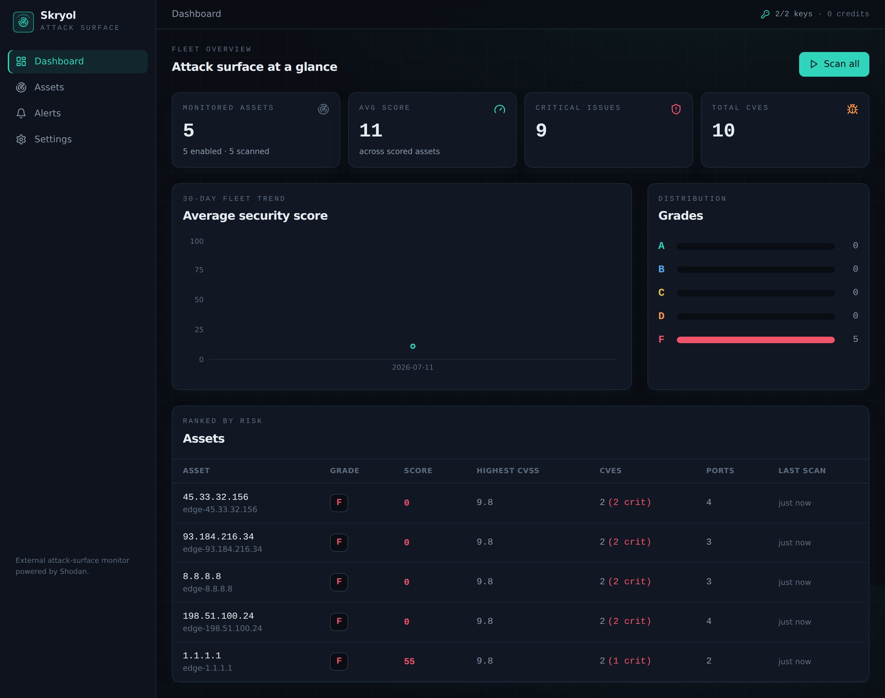
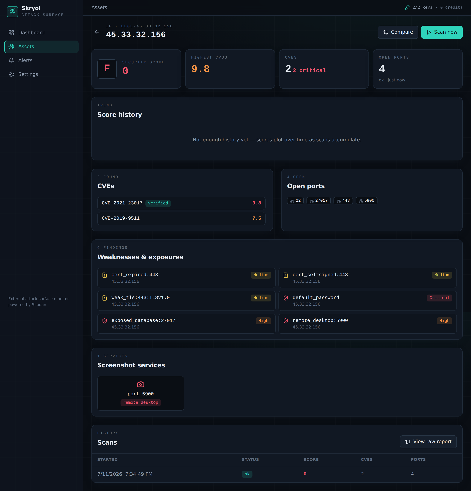
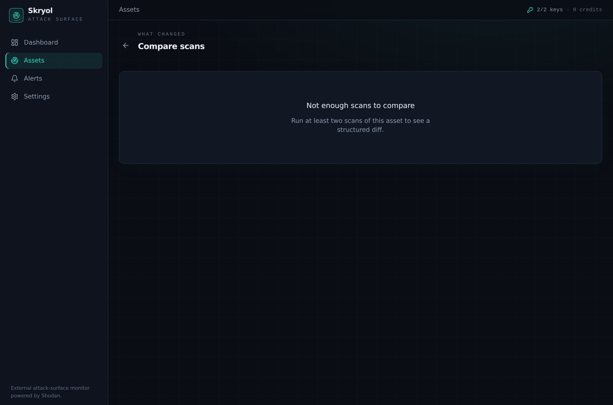
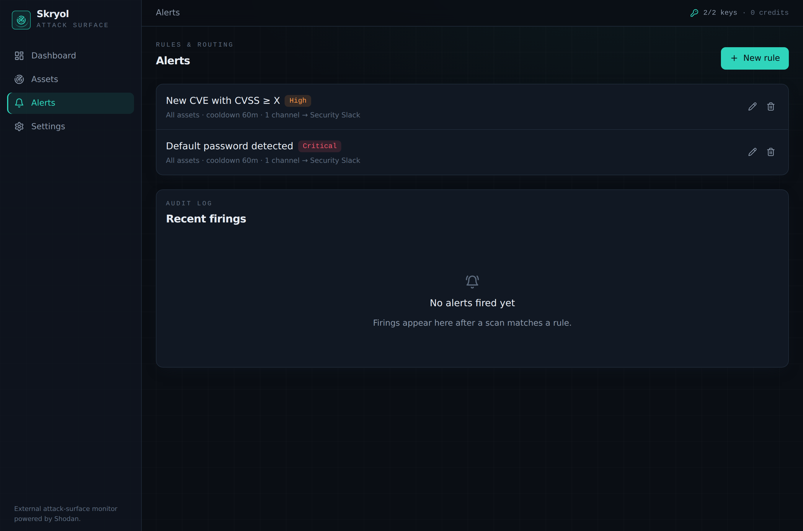
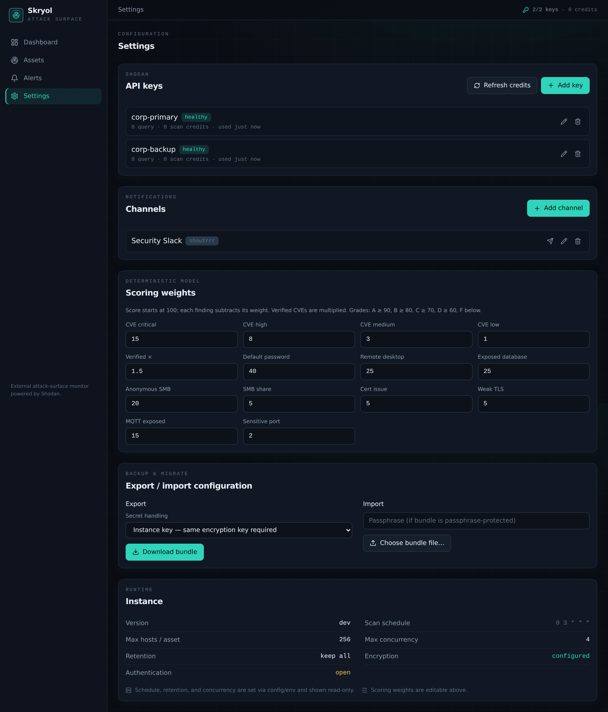
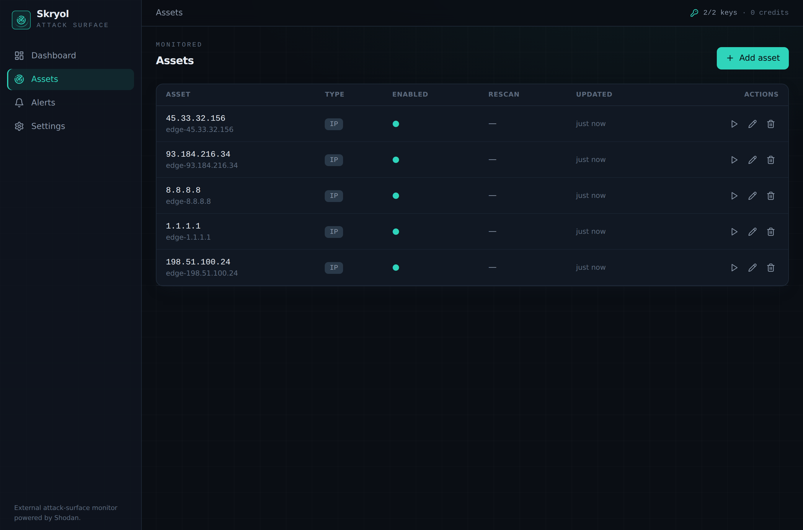
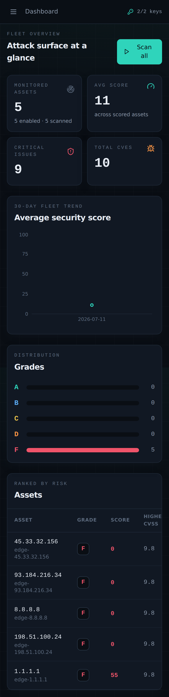

<div align="center">

# Skryol

**Self-hosted external attack-surface monitor, powered by [Shodan](https://www.shodan.io/).**

Skryol watches everything the internet already knows about your assets. It runs a
daily Shodan sweep of your IPs, hostnames, domains, and CIDR ranges; stores the
full raw report of every scan; diffs each scan against the last; scores each
asset with a transparent, deterministic model; and fires routed alerts when
something changes — a new CVE, an exposed database, a default password, a fresh
remote-desktop service.

[Features](#features) · [Screenshots](#screenshots) · [Quick start](#quick-start) · [Configuration](#configuration) · [Shodan keys](#shodan-api-keys) · [API](#api) · [Security](#security-notes)

</div>

---

## Features

- **Asset monitoring** — track single **IPs**, **hostnames** (re-resolved each
  scan), **domains** (subdomains enumerated via Shodan DNS), and **CIDR ranges**
  (expanded to member hosts, with a hard cap). Enable/disable any asset without
  deleting it.
- **Multi-key Shodan rotation** — configure any number of API keys; Skryol
  distributes requests least-recently-used across healthy keys, rate-limits per
  key, backs off on 429s, and rotates away from exhausted/invalid keys. Per-key
  credit and health are shown in the UI.
- **Daily scans + on-demand** — one scheduled batch plus per-asset and
  fleet-wide "Scan now". Every scan stores the **complete raw Shodan report** so
  you can inspect and compare the original data, not just derived findings.
- **Rich posture** — per asset: CVEs (with CVSS and verified badges), open
  ports, default-password indicators, VNC/RDP/HTTP **screenshots**, exposed SMB
  shares, MQTT topics, exposed databases, TLS/cert issues, and Shodan tags.
- **Deterministic scoring** — a documented, tunable weight table turns findings
  into a 0–100 score and an A–F grade. No black box; the weights are editable in
  Settings.
- **Scan-to-scan diff** — added/removed ports, new/resolved CVEs, CVSS changes,
  score delta, and reachability changes. Compare **any two** stored scans.
- **Alerts** — rules (global or per-asset) for new open ports, new CVEs (with a
  CVSS floor), score drops, grade drops, default passwords, new screenshot
  services, new SMB shares, exposed databases, cert issues, offline/online, and
  scan failures. Dedup + cooldown per rule; every firing is logged.
- **Notifications** — [Shoutrrr](https://github.com/containrrr/shoutrrr) (Slack,
  Telegram, Discord, email, ntfy, generic webhook, …), **GreenAPI WhatsApp**,
  and self-hosted **WhatsApp Web**. Test any channel before saving.
- **Dashboard** — fleet KPIs, assets ranked by risk, grade distribution, and a
  30-day fleet score trend.
- **Optional auth** — argon2id password login, hashed bearer/API tokens, and a
  session cookie. Open by default for home-lab use.
- **Export / import** — portable config bundles with a three-mode secret
  strategy (none / instance-key / passphrase).
- **Operations** — structured `log/slog` logging, Prometheus metrics at
  `/metrics`, health at `/healthz`, and an OpenAPI 3.1 reference at `/api/docs`.

Skryol performs **no direct scanning of third-party hosts** — Shodan is the only
data source, and on-demand rescans go through Shodan's own scan API.

## Screenshots

### Dashboard
Fleet KPIs, risk-ranked assets, grade distribution, and the score trend.



### Asset detail
Full posture: CVEs, open ports, weaknesses, screenshot services, score history,
scan history, and the raw report.



### Compare scans
Structured diff between any two scans — what appeared, what was resolved, CVSS
changes, and the score delta.



### Alerts
Rules routed to notification channels, plus the firing audit log.



### Settings
Shodan keys with live credit/health, notification channels, the tunable scoring
weights, and backup/migrate.



### Assets
CRUD, enable/disable, per-asset "Scan now".



### Mobile
Responsive and dark by default, down to ~360px.



## Quick start

### Docker

```bash
docker run -d --name skryol \
  -p 8080:8080 \
  -v skryol-data:/data \
  -e SKRYOL_CRYPTO_ENCRYPTION_KEY="$(openssl rand -hex 32)" \
  techblog/skryol:latest
```

Open <http://localhost:8080>, go to **Settings → Shodan keys**, add at least one
Shodan API key, then add assets and scan.

> Persist the `skryol-data` volume: it holds the SQLite database, screenshots,
> and encrypted secrets. Keep `SKRYOL_CRYPTO_ENCRYPTION_KEY` stable — it decrypts
> your stored keys and channel credentials.

### docker-compose

```yaml
services:
  skryol:
    image: techblog/skryol:latest
    ports: ["8080:8080"]
    volumes:
      - skryol-data:/data
    environment:
      SKRYOL_CRYPTO_ENCRYPTION_KEY: "replace-with-a-32-byte-hex-or-base64-key"
      LOG_LEVEL: info
    restart: unless-stopped
volumes:
  skryol-data:
```

### From source

```bash
# Frontend (embedded into the binary)
cd web && npm ci && npm run build && cd ..

# Binary
CGO_ENABLED=0 go build -o skryol ./cmd/skryol

SKRYOL_CRYPTO_ENCRYPTION_KEY="$(openssl rand -hex 32)" \
  ./skryol --server.port 8080 --database.path ./data/skryol.db
```

Requires Go 1.25+ and Node 20+.

## Configuration

Precedence, highest to lowest: **command-line flags → environment variables
(`SKRYOL_` prefix) → YAML config file → built-in defaults.** Any nested key maps
to an env var by upper-casing and replacing `.` with `_` (e.g. `server.port` →
`SKRYOL_SERVER_PORT`). A full annotated `config.example.yaml` ships in the repo.

### CLI flags

| Flag | Purpose |
|---|---|
| `--config <path>` | Path to a YAML config file. |
| `--server.port <n>` | HTTP listen port (default `8080`). |
| `--server.address <addr>` | HTTP listen address (default `0.0.0.0`). |
| `--log.level <level>` | `debug` / `info` / `warning` / `error`. |
| `--log.format <fmt>` | `json` (prod) or `text` (dev). |
| `--database.path <path>` | SQLite database file (default `/data/skryol.db`). |
| `--data.dir <path>` | Data directory for screenshots/runtime files. |
| `--scanner.schedule "<cron>"` | Daily batch cron (default `0 3 * * *`). |
| `--auth.enabled` | Require authentication for the UI/API. |
| `--reset-password` | Interactively reset the admin password, then exit. |
| `--version` | Print the version and exit. |

### Environment variables

| Variable | Default | Description |
|---|---|---|
| `SKRYOL_CRYPTO_ENCRYPTION_KEY` | — | **Required to store secrets.** 32 bytes as hex (64 chars) or base64. Encrypts Shodan keys and channel credentials at rest. |
| `SKRYOL_SERVER_PORT` | `8080` | HTTP port. |
| `SKRYOL_SERVER_ADDRESS` | `0.0.0.0` | Listen address. |
| `SKRYOL_SERVER_BASE_URL` | — | Public base URL, used for deep links in alerts. |
| `SKRYOL_LOG_LEVEL` / `LOG_LEVEL` | `info` | Log level. |
| `SKRYOL_LOG_FORMAT` | `json` | `json` or `text`. |
| `SKRYOL_DATABASE_PATH` | `/data/skryol.db` | SQLite path. |
| `SKRYOL_SHODAN_BASE_URL` | `https://api.shodan.io` | Shodan API base. |
| `SKRYOL_SHODAN_REQUESTS_PER_SECOND` | `1.0` | Per-key rate limit. |
| `SKRYOL_SCANNER_SCHEDULE` | `0 3 * * *` | Daily batch cron. |
| `SKRYOL_SCANNER_MAX_HOSTS_PER_ASSET` | `256` | CIDR/host expansion cap. |
| `SKRYOL_SCANNER_MAX_CONCURRENCY` | `4` | Concurrent asset scans. |
| `SKRYOL_SCANNER_RETENTION_DAYS` | `0` | `0` = keep all raw reports; else prune older. |
| `SKRYOL_AUTH_ENABLED` | `false` | Require auth. |
| `SKRYOL_AUTH_USERNAME` | `admin` | Admin username. |
| `SKRYOL_AUTH_PASSWORD` | — | Bootstrap password (first run only). |
| `SKRYOL_AUTH_GUARD_METRICS` | `true` | When auth is on, guard `/metrics` too (its labels carry asset identifiers/scores). Set `false` to keep it open for Prometheus over a trusted network. |

## Shodan API keys

1. Get an API key from your [Shodan account](https://account.shodan.io/).
2. In Skryol, open **Settings → Shodan keys → Add key** and paste it. The key is
   encrypted at rest and never returned by the API.
3. Add more keys to pool monthly credits and raise throughput — with N keys the
   effective rate is ~N requests/second. Skryol rotates least-recently-used
   across healthy keys, backs off on rate limits, and skips exhausted/invalid
   keys automatically. Per-key credits and health are shown in the UI.

Domain enumeration and on-demand rescans consume additional Shodan credits; the
core host lookups use query credits.

## Scoring model

Each asset starts at **100** and loses weighted points per finding, clamped to
0–100. Weights are documented and editable in **Settings → Scoring weights**.

| Finding | Default penalty |
|---|---|
| CVE — critical / high / medium / low | 15 / 8 / 3 / 1 |
| Verified CVE | × 1.5 |
| Default password | 40 |
| Exposed remote desktop (VNC/RDP) | 25 |
| Exposed database | 25 |
| Anonymous SMB share | 20 |
| MQTT broker exposed | 15 |
| SMB share / cert issue / weak TLS | 5 each |
| Each sensitive open port | 2 |

Grades: **A** ≥ 90, **B** ≥ 80, **C** ≥ 70, **D** ≥ 60, **F** below 60.

## API

Every UI action maps to a REST endpoint under `/api/v1`. The interactive
reference (Swagger UI) is served at **`/api/docs`**, and the machine-readable
OpenAPI 3.1 spec at **`/api/docs/openapi.yaml`**.

**Authentication** (when `auth.enabled`): send an API token via
`X-API-Token: <token>` or `Authorization: Bearer <token>`, or use the session
cookie from `POST /api/v1/auth/login`. When auth is disabled, the API is open.

A few representative endpoints:

```
GET    /api/v1/dashboard                 # fleet summary + rankings + trend
GET    /api/v1/assets                     # list assets
POST   /api/v1/assets                     # add an asset
POST   /api/v1/assets/{id}/scan           # scan an asset now
GET    /api/v1/assets/{id}/diff?from=&to= # compare two scans
POST   /api/v1/scan                       # fleet-wide scan
GET    /api/v1/scans/{id}                 # scan + findings + raw report
GET/POST/PUT/DELETE /api/v1/rules         # alert rules
GET/POST/PUT/DELETE /api/v1/channels      # notification channels
POST   /api/v1/channels/{id}/test         # send a real test message
GET/POST/PUT/DELETE /api/v1/shodan/keys   # Shodan keys
POST   /api/v1/export | /api/v1/import    # config backup/migrate
GET    /healthz  ·  GET /metrics          # health + Prometheus
```

## Export / import

**Settings → Backup & migrate** produces a portable configuration bundle
(assets, keys, channels, rules) with three secret strategies:

- **none** — no secrets; keys/channels import disabled and flagged as needing
  credentials.
- **instance_key** — carries existing ciphertexts plus a non-reversible key
  fingerprint; import succeeds only where the same
  `SKRYOL_CRYPTO_ENCRYPTION_KEY` is provisioned (clean-install path).
- **passphrase** — re-encrypts secrets under an argon2id-derived key so the
  bundle is portable across instances with different keys.

Import is idempotent and reports what was created, updated, and skipped.

## Security notes

- All secrets (Shodan keys, channel credentials) are stored **AES-256-GCM
  encrypted at rest**. They are never logged and never returned in plaintext by
  the API. Set `SKRYOL_CRYPTO_ENCRYPTION_KEY` before adding any secret.
- **Running with auth disabled exposes your full asset posture** — CVEs, open
  ports, screenshots, and weaknesses — to anyone who can reach the port. Enable
  `auth.enabled` for any non-trusted network. When auth is enabled, `/metrics`
  and the `/api/docs` reference are guarded too by default (metric labels carry
  asset identifiers and scores); set `auth.guard_metrics=false` only to expose
  `/metrics` to a trusted Prometheus scraper.
- Asset inputs (IP / CIDR / FQDN / domain) are validated and normalized; CIDR
  expansion is capped by `scanner.max_hosts_per_asset`.
- The image runs as a non-root user from a minimal `scratch` base. Mount `/data`
  as a named volume so the non-root user can write the database and key files.
- Skryol never scans third-party hosts directly; all data comes from Shodan.

## License

[Apache-2.0](LICENSE).
