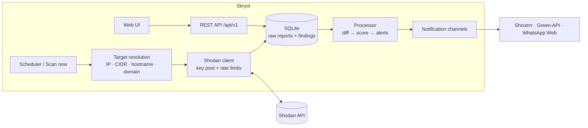

<div align="center">

# Skryol

**Self-hosted external attack-surface monitor, powered by [Shodan](https://www.shodan.io/).**

[](https://hub.docker.com/r/techblog/skryol)
[](https://hub.docker.com/r/techblog/skryol)
[](LICENSE)

Skryol watches everything the internet already knows about your assets. It runs a
daily Shodan sweep of your IPs, hostnames, domains, and CIDR ranges; stores the
full raw report of every scan; diffs each scan against the last; scores each
asset with a transparent, deterministic model; and fires routed alerts when
something changes: a new CVE, an exposed database, a default password, a fresh
remote-desktop service.

[Features](#features) · [Screenshots](#screenshots) · [Quick start](#quick-start) · [Configuration](#configuration) · [Shodan keys](#shodan-api-keys) · [Alerts](#alert-rules) · [API](#api) · [Security](#security-notes)

</div>

> **Responsible use.** Only monitor assets you own or are explicitly authorized
> to assess, and follow [Shodan's terms of service](https://account.shodan.io/legal).
> Skryol is an independent project and is **not affiliated with, endorsed by, or
> sponsored by Shodan**.

---

## Table of contents

- [Features](#features)
- [Screenshots](#screenshots)
- [How it works](#how-it-works)
- [Requirements](#requirements)
- [Quick start](#quick-start)
- [Configuration](#configuration)
- [Shodan API keys](#shodan-api-keys)
- [Assets and scanning](#assets-and-scanning)
- [Scoring model](#scoring-model)
- [Alert rules](#alert-rules)
- [Notification channels](#notification-channels)
- [Authentication](#authentication)
- [API](#api)
- [Metrics and health](#metrics-and-health)
- [Export / import](#export--import)
- [Security notes](#security-notes)
- [Troubleshooting](#troubleshooting)
- [Development](#development)
- [Contributing](#contributing)
- [License](#license)

## Features

- **Asset monitoring**: track single **IPs** (IPv4/IPv6), **hostnames**
  (re-resolved through Shodan DNS on every scan), **domains** (subdomains
  enumerated via Shodan DNS), and **CIDR ranges** (expanded to member hosts,
  bounded by a hard cap). Enable or disable any asset without deleting it.
- **Multi-key Shodan rotation**: configure any number of API keys. Skryol
  distributes requests least-recently-used across healthy keys, rate-limits per
  key, backs off on 429s, and rotates away from exhausted or invalid keys.
  Per-key credits and health are shown in the UI.
- **Daily scans + on demand**: one scheduled batch (cron), plus per-asset and
  fleet-wide "Scan now". Every scan stores the **complete raw Shodan report** so
  you can inspect the original data, not just derived findings.
- **Rich posture**: per asset, CVEs (with CVSS and verified badges), open
  ports, default-password indicators, VNC/RDP/HTTP **screenshot services**,
  exposed SMB shares, MQTT exposure, exposed databases, TLS/certificate issues,
  and Shodan tags.
- **Deterministic scoring**: a documented, tunable weight table turns findings
  into a 0–100 score and an A–F grade. No black box; the weights are editable in
  Settings.
- **Scan-to-scan diff**: added/removed findings, new/resolved CVEs, CVSS
  changes, score and grade delta, and online/offline changes. Compare **any
  two** stored scans of an asset.
- **Alerts**: 13 rule conditions (global or per-asset), including new open
  ports, new CVEs (with a CVSS floor), score drops, grade drops, default
  passwords, new screenshot services, new SMB shares, exposed databases, cert
  issues, offline/online, and scan failures. Per-rule cooldown; every firing is
  written to an audit log.
- **Notifications**: [Shoutrrr](https://github.com/containrrr/shoutrrr) (Slack,
  Telegram, Discord, email, ntfy, generic webhook, and more), **Green-API
  WhatsApp**, and self-hosted **WhatsApp Web**. Test any channel before saving.
- **Dashboard**: fleet KPIs, assets ranked by risk, grade distribution, and a
  30-day fleet score trend.
- **Runtime settings from the UI**: log level, scan schedule and guardrails,
  auth, and Shodan client settings can be edited in **Settings** and are
  written back to the YAML config file (hot-applied where safe, otherwise on
  the next restart).
- **Optional auth**: argon2id password login, HMAC-signed session cookie, and
  hashed API tokens. Open by default for home-lab use.
- **Export / import**: portable config bundles with a three-mode secret
  strategy (none / instance key / passphrase).
- **Operations**: structured `log/slog` logging (JSON or text), Prometheus
  metrics at `/metrics`, health at `/healthz`, and an OpenAPI 3.1 reference at
  `/api/docs`.

Skryol performs **no direct scanning of third-party hosts**. Shodan is the only
data source, and optional rescans go through Shodan's own on-demand scan API.

## Screenshots

### Dashboard
Fleet KPIs, risk-ranked assets, grade distribution, and the score trend.


### Asset detail
Full posture: CVEs, open ports, weaknesses, screenshot services, score history,
scan history, and the raw report.


### Compare scans
Structured diff between any two scans: what appeared, what was resolved, CVSS
changes, and the score delta.


### Alerts
Rules routed to notification channels, plus the firing audit log.


### Settings
Shodan keys with live credit/health, notification channels, the tunable scoring
weights, and backup/migrate.


<!-- TODO: screenshot — the Settings page was redesigned after this capture (runtime settings: authentication, server, logging, scanner, Shodan client). -->

### Assets
Add, edit, delete, enable/disable, and per-asset "Scan now".


### Mobile
Responsive dark theme, down to ~360px.


## How it works


```mermaid
flowchart LR
    subgraph Skryol
        S[Scheduler / Scan now] --> R[Target resolution<br/>IP · CIDR · hostname · domain]
        R --> C[Shodan client<br/>key pool + rate limits]
        C --> DB[(SQLite<br/>raw reports + findings)]
        DB --> P[Processor<br/>diff → score → alerts]
        P --> N[Notification channels]
        UI[Web UI] --> API[REST API /api/v1]
        API --> DB
    end
    C <--> SH[(Shodan API)]
    N --> OUT[Shoutrrr · Green-API · WhatsApp Web]
```

1. The scheduler (or a manual "Scan now") picks the enabled assets.
2. Each asset is resolved to concrete IPs: CIDRs are expanded, hostnames are
   resolved with Shodan DNS, and domains are enumerated with Shodan's domain
   endpoint and then resolved.
3. Each IP is looked up with Shodan's host endpoint. The full raw response is
   stored, and findings (ports, CVEs, weaknesses, screenshots, SMB, certs) are
   normalized.
4. The processor diffs the scan against the previous one, computes the score and
   grade, and evaluates alert rules, which send to the routed channels.

Everything (assets, scans, raw reports, findings, rules, channels, encrypted
secrets, users, tokens) lives in a single SQLite database (pure Go, no CGO).

## Requirements

- One or more [Shodan API keys](https://account.shodan.io/). Domain enumeration
  and on-demand rescans need a plan with query/scan credits.
- A 32-byte encryption key (`SKRYOL_CRYPTO_ENCRYPTION_KEY`) to store Shodan keys
  and channel credentials.
- Docker, **or** Go 1.25+ and Node 20+ to build from source.

## Quick start

### Docker

Images are published to Docker Hub as `techblog/skryol` for `linux/amd64`,
`linux/arm64`, and `linux/arm/v7` (tags: `latest` and date-based versions such
as `2026.7.1`).

```bash
docker run -d --name skryol \
  -p 8080:8080 \
  -v skryol-data:/data \
  -e SKRYOL_CRYPTO_ENCRYPTION_KEY="$(openssl rand -hex 32)" \
  -e SKRYOL_CONFIG=/data/config.yaml \
  techblog/skryol:latest
```

Open <http://localhost:8080>, go to **Settings → API keys**, add at least one
Shodan API key, then add assets and scan.

> Persist the `skryol-data` volume: it holds the SQLite database (scans, raw
> reports, and encrypted secrets). Keep `SKRYOL_CRYPTO_ENCRYPTION_KEY` stable: it
> decrypts your stored keys and channel credentials. Generate it **once** and
> store it somewhere safe; the `$(openssl rand ...)` above creates a new key each
> time the command runs.
>
> `SKRYOL_CONFIG=/data/config.yaml` points the config file at the writable
> volume, so edits made in **Settings** can be saved. Without it, Skryol writes
> to `config.yaml` in the working directory, which is not writable in the image.

### Docker Compose

A compose file based on the repository's [`docker-compose.yml`](docker-compose.yml), with the adjustments noted below:

```yaml
services:
  skryol:
    image: techblog/skryol:latest
    ports:
      - "8080:8080"
    volumes:
      - skryol-data:/data
    environment:
      SKRYOL_CRYPTO_ENCRYPTION_KEY: "replace-with-a-32-byte-hex-or-base64-key"
      SKRYOL_CONFIG: /data/config.yaml
      SKRYOL_LOG_LEVEL: info
      # Uncomment to require authentication:
      # SKRYOL_AUTH_ENABLED: "true"
      # SKRYOL_AUTH_PASSWORD: "change-me-on-first-run"
    restart: unless-stopped

volumes:
  skryol-data:
```

Replace the placeholder key (for example with `openssl rand -hex 32`) before
the first start; an invalid key stops Skryol from starting.

> The shipped `docker-compose.yml` sets `LOG_LEVEL`, which Skryol does not read
> (only `SKRYOL_`-prefixed variables are used), and does not set
> `SKRYOL_CONFIG`. The example above uses the variables Skryol reads.

### Prebuilt binaries

A GoReleaser configuration builds Linux `amd64`, `arm64`, and `armv7` archives,
but no GitHub release has been published yet. Use Docker or build from source.

### From source

```bash
# Frontend (built straight into internal/web/dist and embedded in the binary)
cd web && npm ci && npm run build && cd ..

# Binary
CGO_ENABLED=0 go build -o skryol ./cmd/skryol

SKRYOL_CRYPTO_ENCRYPTION_KEY="$(openssl rand -hex 32)" \
  ./skryol --server.port 8080 --database.path ./data/skryol.db --log.format text
```

The database directory is created if missing.

## Configuration

Precedence, highest to lowest: **command-line flags → environment variables
(`SKRYOL_` prefix) → YAML config file → built-in defaults.** Any nested key maps
to an env var by upper-casing and replacing `.` with `_` (for example
`server.port` → `SKRYOL_SERVER_PORT`). A fully annotated
[`config.example.yaml`](config.example.yaml) ships in the repo.

**Config file location:** `--config <path>` or `SKRYOL_CONFIG`; otherwise
Skryol looks for `config.yaml` in the working directory, then in
`/etc/skryol/`. A missing file is fine (defaults apply). Settings saved from the
UI are written to that file (or to `./config.yaml` if none was found).

### CLI flags

| Flag | Default | Purpose |
|---|---|---|
| `--config <path>` | — | Path to a YAML config file. |
| `--server.port <n>` | `8080` | HTTP listen port. |
| `--server.address <addr>` | `0.0.0.0` | HTTP listen address. |
| `--log.level <level>` | `info` | `debug` / `info` / `warning` / `error`. |
| `--log.format <fmt>` | `json` | `json` or `text`. |
| `--database.path <path>` | `/data/skryol.db` | SQLite database file. |
| `--data.dir <path>` | `/data` | Data directory. Currently unused: screenshots and raw reports are stored in the database. |
| `--scanner.schedule "<cron>"` | `0 3 * * *` | Daily batch cron (standard 5-field). |
| `--auth.enabled` | `false` | Require authentication for the UI/API. |
| `--reset-password` | — | Interactively reset the admin password (min. 8 chars), then exit. |
| `--version` | — | Print the version and exit. |
| `--help` | — | Show usage. |

A flag that is set explicitly pins its key: the matching field is read-only in
the Settings UI.

### Configuration keys

"UI" shows whether the key is editable in **Settings**: **hot** = applied
immediately, **restart** = saved to YAML and applied on the next start, **—** =
not editable from the UI. A key set through an env var or flag is shown
read-only.

| YAML key | Env var | Default | UI | Description |
|---|---|---|---|---|
| `server.port` | `SKRYOL_SERVER_PORT` | `8080` | restart | HTTP port. |
| `server.address` | `SKRYOL_SERVER_ADDRESS` | `0.0.0.0` | restart | Listen address. |
| `server.base_url` | `SKRYOL_SERVER_BASE_URL` | — | restart | Public base URL, used for asset deep links in alert messages. |
| `server.enable_cors` | `SKRYOL_SERVER_ENABLE_CORS` | `false` | restart | Send permissive (`*`) CORS headers. |
| `log.level` | `SKRYOL_LOG_LEVEL` | `info` | hot | `debug` / `info` / `warning` / `error`. |
| `log.format` | `SKRYOL_LOG_FORMAT` | `json` | restart | `json` or `text`. |
| `database.path` | `SKRYOL_DATABASE_PATH` | `/data/skryol.db` | — | SQLite path. |
| `data.dir` | `SKRYOL_DATA_DIR` | `/data` | — | Reserved; not used by the current code. |
| `crypto.encryption_key` | `SKRYOL_CRYPTO_ENCRYPTION_KEY` | — | — | **Required to store secrets.** 32 bytes as 64-char hex or base64. Prefer the env var over the YAML file. |
| `shodan.base_url` | `SKRYOL_SHODAN_BASE_URL` | `https://api.shodan.io` | restart | Shodan API base URL. |
| `shodan.requests_per_second` | `SKRYOL_SHODAN_REQUESTS_PER_SECOND` | `1.0` | restart | Default per-key rate limit. |
| `shodan.max_retries` | `SKRYOL_SHODAN_MAX_RETRIES` | `4` | restart | Retries per Shodan request (rotating keys). |
| `shodan.timeout_seconds` | `SKRYOL_SHODAN_TIMEOUT_SECONDS` | `30` | restart | HTTP timeout per Shodan request. |
| `scanner.schedule` | `SKRYOL_SCANNER_SCHEDULE` | `0 3 * * *` | hot | Daily batch cron. |
| `scanner.max_hosts_per_asset` | `SKRYOL_SCANNER_MAX_HOSTS_PER_ASSET` | `256` | hot | Max IPs per asset; larger CIDRs or resolutions fail the scan. |
| `scanner.max_concurrency` | `SKRYOL_SCANNER_MAX_CONCURRENCY` | `4` | hot | Concurrent asset scans in a batch. |
| `scanner.retention_days` | `SKRYOL_SCANNER_RETENTION_DAYS` | `0` | hot | `0` = keep all raw reports; otherwise prune raw reports older than N days after each batch. |
| `scanner.rescan_timeout_seconds` | `SKRYOL_SCANNER_RESCAN_TIMEOUT_SECONDS` | `300` | hot | How long to wait for a Shodan on-demand rescan. |
| `auth.enabled` | `SKRYOL_AUTH_ENABLED` | `false` | hot | Require auth for the UI/API. |
| `auth.username` | `SKRYOL_AUTH_USERNAME` | `admin` | hot | Admin username. |
| `auth.password` | `SKRYOL_AUTH_PASSWORD` | — | — | Bootstrap password, used only when the first admin account is created. |
| `auth.session_secret` | `SKRYOL_AUTH_SESSION_SECRET` | — | — | HMAC secret for session cookies. If blank, a random one is generated per start (sessions reset on restart). |
| `auth.guard_metrics` | `SKRYOL_AUTH_GUARD_METRICS` | `true` | hot | When auth is on, also guard `/metrics` (its labels carry asset identifiers and scores). |

Secrets and infrastructure keys (`crypto.encryption_key`, `auth.password`,
`auth.session_secret`, `database.path`, `data.dir`) are never written to the
YAML file from the UI. The admin password can also be set from **Settings →
Authentication**; it is stored hashed in the database, never in the file.

## Shodan API keys

1. Get an API key from your [Shodan account](https://account.shodan.io/).
2. In Skryol, open **Settings → API keys → Add key** and paste it. The key is
   encrypted at rest and never returned by the API. Adding a key requires
   `SKRYOL_CRYPTO_ENCRYPTION_KEY` to be set.
3. Add more keys to pool credits and raise throughput: with N keys at the
   default rate, the effective rate is about N requests per second. Skryol
   rotates least-recently-used across healthy keys, cools a key down on HTTP 429,
   marks it **invalid** on 401 and **exhausted** on 402/403, and skips those
   keys. **Refresh credits** re-reads `/api-info` for every enabled key; credits
   are also refreshed before each fleet-wide batch.

### Shodan API usage

| Shodan endpoint | Used for |
|---|---|
| `GET /shodan/host/{ip}` | Every target IP in every scan. |
| `GET /dns/resolve` | Hostname assets, and domain subdomains. |
| `GET /dns/domain/{domain}` | Domain assets (subdomain enumeration). Uses query credits. |
| `POST /shodan/scan`, `GET /shodan/scan/{id}` | Only for assets with **Rescan** enabled. Uses scan credits. |
| `GET /api-info` | Key credits, plan, and health. |

<!-- TODO: verify — which of these consume query credits depends on the Shodan plan; check Shodan's API docs before relying on exact credit costs. -->

A fleet-wide batch is aborted if no key is healthy.

## Assets and scanning

| Type | Value | Resolution |
|---|---|---|
| `ip` | IPv4 or IPv6 address | Looked up directly. |
| `cidr` | Network prefix (normalized to the network address) | Expanded to all member addresses. Ranges larger than `scanner.max_hosts_per_asset` fail with an error rather than being truncated. |
| `fqdn` | Hostname | Resolved via Shodan DNS on every scan. |
| `domain` | Domain | Subdomains enumerated via Shodan, then resolved; capped at `scanner.max_hosts_per_asset`. |

- **Schedule**: one batch per cron tick (default 03:00 daily) scans every
  enabled asset, with up to `scanner.max_concurrency` assets in parallel.
- **Scan now** (per asset or fleet-wide) runs synchronously in the request.
  Every HTTP route runs under a 120-second request timeout, so a manual scan
  that takes longer (a large fleet, big CIDRs, or a rescan, whose wait defaults
  to 300 seconds) is cut off at 120 seconds. Scheduled batches get up to
  6 hours.
- **Rescan**: when enabled on an asset, Skryol first asks Shodan to re-crawl
  the asset's IPs (on-demand scan API), waits up to
  `scanner.rescan_timeout_seconds`, then reads the host data. This applies to
  both scheduled and manual scans of that asset and spends scan credits.
- **Scan status** is `ok`, `partial` (some targets failed), or `failed`. An IP
  with no Shodan data counts as a valid, offline result.

## Scoring model

Each asset starts at **100** and loses weighted points per finding, clamped to
0–100. Weights are documented and editable in **Settings → Scoring weights**.

| Finding | Default penalty |
|---|---|
| CVE: critical (CVSS ≥ 9.0) / high (7.0–8.9) / medium (4.0–6.9) / low | 15 / 8 / 3 / 1 |
| Verified CVE | × 1.5 |
| Default password | 40 |
| Exposed remote desktop (VNC/RDP) | 25 |
| Exposed database | 25 |
| Anonymous SMB share | 20 |
| MQTT broker exposed | 15 |
| SMB share / cert issue / weak TLS | 5 each |
| Each sensitive open port | 2 |

Sensitive ports: 21, 23, 135, 139, 445, 1433, 3306, 3389, 5432, 5900, 6379,
9200, 11211, 27017.

Grades: **A** ≥ 90, **B** ≥ 80, **C** ≥ 70, **D** ≥ 60, **F** below 60.

## Alert rules

Rules are created on the **Alerts** page (or via `/api/v1/rules`). Each rule has
a scope (**global** or a single asset), a condition, a severity, a cooldown,
and one or more notification channels. Rules are evaluated after every scan
with status `ok` or `partial`; failed scans skip rule evaluation.

| Condition | Fires when | Parameter (default) |
|---|---|---|
| `new_open_port` | A port appears | — |
| `new_cve` | A CVE appears | `min_cvss` (0) |
| `cve_cvss_at_least` | A CVE with CVSS ≥ threshold appears | `cvss` (7.0) |
| `score_drop_at_least` | The score drops by ≥ N points | `points` (10) |
| `grade_drops_below` | The grade crosses below a threshold | `grade` (B) |
| `default_password_detected` | A default-password finding appears | — |
| `new_screenshot_service` | A screenshot service appears | `remote_only` (false) |
| `new_smb_share` | An SMB share appears | — |
| `new_exposed_database` | An exposed database appears | — |
| `cert_expired_or_selfsigned` | An expired or self-signed cert appears | — |
| `asset_offline` | The asset went offline in Shodan | — |
| `asset_online` | The asset came back online | — |
| `scan_failed` | The scan failed (currently never fires; see [Troubleshooting](#troubleshooting)) | — |

**Cooldown**: when `cooldown_seconds` is above 0, a repeat firing of a
finding-based condition (same rule, asset, condition, and finding set) is
suppressed until the cooldown passes. Scan-level conditions (`scan_failed`,
`asset_offline`, `asset_online`, `score_drop_at_least`, `grade_drops_below`)
include the scan ID in their signature, so cooldown never suppresses them:
they fire on every matching scan. Every firing is recorded in the audit log (**Alerts → Recent firings**,
`GET /api/v1/alerts/events`) with the delivery result per channel.

If `server.base_url` is set, messages include a link to the asset page.

## Notification channels

Configure channels in **Settings → Channels**. Credentials are encrypted at rest
and masked in API responses. **Send test** works on a saved channel or on
unsaved form values.

| Provider | Fields |
|---|---|
| **Shoutrrr** | Service URL, e.g. `slack://…`, `telegram://…`, `discord://…`, `smtp://…`, `ntfy://…`, `generic://…`. See the [Shoutrrr docs](https://containrrr.dev/shoutrrr/). |
| **Green-API (WhatsApp)** | Instance ID, token, recipient phone (international format, digits only), optional API URL (default `https://api.green-api.com`). `@c.us` is appended to the phone automatically. |
| **WhatsApp Web (self-hosted)** | Base URL of a [go-whatsapp-web-multidevice](https://github.com/aldinokemal/go-whatsapp-web-multidevice) instance, recipient phone, optional basic-auth username/password. |

Sending is best-effort: failures are logged and recorded in the audit log and
never fail the scan.

## Authentication

Auth is **off by default**. To turn it on, set `SKRYOL_AUTH_ENABLED=true` (or
`--auth.enabled`), or toggle it in **Settings → Authentication** (an admin
password must be set first).

- **Admin account**: single user (`auth.username`, default `admin`). On first
  start with auth enabled, the account is created with `SKRYOL_AUTH_PASSWORD`;
  if that is empty, a random password is generated and written **once to the
  log**. Change it with `skryol --reset-password` or in Settings. Passwords are
  hashed with argon2id.
- **Sessions**: `POST /api/v1/auth/login` sets an HttpOnly `skryol_session`
  cookie valid for 12 hours. Set `auth.session_secret` to keep sessions valid
  across restarts.
- **API tokens**: created via `POST /api/v1/auth/tokens` (the plaintext is
  returned once; only a SHA-256 hash is stored), listed and revoked under the
  same path. There is no UI for tokens yet. Send a token as
  `X-API-Token: <token>` or `Authorization: Bearer <token>`.

Always open when auth is enabled: `/healthz`, `/api/v1/health`,
`/api/v1/auth/login`, `/api/v1/auth/logout`, `/api/v1/auth/me`, and the web UI
shell (which shows a login screen).

## API

Every UI action maps to a REST endpoint under `/api/v1`. The interactive
reference (Swagger UI) is served at **`/api/docs`**, and the OpenAPI 3.1 spec at
**`/api/docs/openapi.yaml`** (source: [`internal/api/openapi.yaml`](internal/api/openapi.yaml)).
Both require auth when auth is enabled. The Swagger UI loads its assets from the
jsDelivr CDN.

| Method | Path | Purpose |
|---|---|---|
| `GET` | `/api/v1/health` | Health (same as `/healthz`). |
| `POST` | `/api/v1/auth/login` · `/auth/logout` | Start / end a session. |
| `GET` | `/api/v1/auth/me` | Whether auth is required and the caller is authenticated. |
| `GET` `POST` | `/api/v1/auth/tokens` | List / create API tokens. |
| `DELETE` | `/api/v1/auth/tokens/{id}` | Revoke a token. |
| `GET` `POST` | `/api/v1/assets` | List / add assets. |
| `GET` `PUT` `DELETE` | `/api/v1/assets/{id}` | Get / update / delete an asset. |
| `POST` | `/api/v1/assets/{id}/scan` | Scan one asset now. |
| `GET` | `/api/v1/assets/{id}/scans` | Scan history (`?limit=`). |
| `GET` | `/api/v1/assets/{id}/diff?from=&to=` | Compare two scans (defaults to the latest pair). |
| `GET` | `/api/v1/assets/{id}/score-history` | Score history. |
| `POST` | `/api/v1/scan` | Fleet-wide scan now. |
| `GET` | `/api/v1/scans/{id}` | Scan with findings and raw report. |
| `GET` | `/api/v1/dashboard` | Fleet summary, rankings, and trend. |
| `GET` `POST` | `/api/v1/shodan/keys` | List / add Shodan keys. |
| `PUT` `DELETE` | `/api/v1/shodan/keys/{id}` | Update / delete a key. |
| `POST` | `/api/v1/shodan/keys/{id}/refresh` | Refresh credits and health (for all enabled keys). |
| `GET` `POST` | `/api/v1/channels` | List / add channels. |
| `PUT` `DELETE` | `/api/v1/channels/{id}` | Update / delete a channel. |
| `POST` | `/api/v1/channels/test` | Test an unsaved channel config. |
| `POST` | `/api/v1/channels/{id}/test` | Test a saved channel. |
| `GET` `POST` | `/api/v1/rules` | List / create alert rules. |
| `GET` `PUT` `DELETE` | `/api/v1/rules/{id}` | Get / update / delete a rule. |
| `GET` | `/api/v1/alerts/events` | Alert audit log (`?limit=`). |
| `GET` `PUT` | `/api/v1/settings` | Runtime settings, locks, pending restarts, scoring weights, admin password. |
| `POST` | `/api/v1/export` | Export a config bundle. |
| `POST` | `/api/v1/import` | Import a config bundle. |

Example:

```bash
curl -s -H "X-API-Token: $SKRYOL_TOKEN" http://localhost:8080/api/v1/dashboard
```

## Metrics and health

- **`GET /healthz`**: `{"status":"ok","version":"…"}`, or HTTP 503 with
  `"degraded"` if the database is unreachable. Always open.
- **`GET /metrics`**: Prometheus format. Guarded when auth is enabled and
  `auth.guard_metrics` is `true` (the default).

| Metric | Labels | Description |
|---|---|---|
| `skryol_scans_total` | `status` | Asset scans by status. |
| `skryol_scan_duration_seconds` | `asset_type` | Per-asset scan duration (histogram). |
| `skryol_shodan_requests_total` | `endpoint`, `outcome` | Shodan API requests. |
| `skryol_alerts_fired_total` | `condition` | Alert firings. |
| `skryol_asset_score` | `asset` | Latest score per asset. |
| `skryol_http_requests_total` | `method`, `status` | HTTP requests. |
| `skryol_shodan_key_credits` | `key`, `type` | Registered, but not populated by the current code. |

Go runtime and process collectors are included.

## Export / import

**Settings → Backup & migrate** produces a portable configuration bundle
(assets, Shodan keys, channels, and rules) with three secret strategies:

- **none**: no secrets; imported keys and channels are disabled and flagged as
  needing credentials.
- **instance_key**: carries existing ciphertexts plus a non-reversible key
  fingerprint; import succeeds only where the same
  `SKRYOL_CRYPTO_ENCRYPTION_KEY` is provisioned.
- **passphrase**: re-encrypts secrets under an argon2id-derived key so the
  bundle is portable across instances with different keys.

Import is idempotent and reports what was created, updated, and skipped. The
bundle does **not** include scan history, raw reports, scoring weights, users,
or API tokens; back up the `/data` volume (the SQLite database) for those.

## Security notes

- All secrets (Shodan keys, channel credentials) are stored **AES-256-GCM
  encrypted at rest**. They are never returned in plaintext by the API. Set
  `SKRYOL_CRYPTO_ENCRYPTION_KEY` before adding any secret, and keep it out of
  the YAML file and version control.
- **Running with auth disabled exposes your full asset posture** (CVEs, open
  ports, screenshots, and weaknesses) to anyone who can reach the port. Enable
  auth for any untrusted network. When auth is enabled, `/metrics` and the
  `/api/docs` reference are guarded too by default; set
  `auth.guard_metrics=false` only to expose `/metrics` to a trusted Prometheus
  scraper.
- Put Skryol behind a TLS-terminating reverse proxy for remote access. The
  session cookie is never marked `Secure`: Skryol has no TLS listener, and the
  flag is not set even when a TLS proxy is in front.
- If Skryol generates the admin password, it is written to the log once;
  change it after first login and treat old logs as sensitive.
- Asset inputs (IP / CIDR / FQDN / domain) are validated and normalized; CIDR
  expansion is capped by `scanner.max_hosts_per_asset`.
- The image runs as a non-root user (UID 65532) from a minimal `scratch` base.
  Mount `/data` as a named volume so that user can write the database.
- Skryol never scans third-party hosts directly; all data comes from Shodan.

## Troubleshooting

| Symptom | Cause / fix |
|---|---|
| Startup fails with a crypto error | `SKRYOL_CRYPTO_ENCRYPTION_KEY` is not 32 bytes of hex (64 chars) or base64. Replace the compose placeholder. |
| "Encryption key not configured" (HTTP 412) when adding a key or channel | Set `SKRYOL_CRYPTO_ENCRYPTION_KEY` and restart. |
| Saving settings fails in Docker | The config file path is not writable. Set `SKRYOL_CONFIG=/data/config.yaml`. |
| A setting is read-only in the UI | It is pinned by an env var or an explicitly set flag. |
| A CIDR asset always fails | The range exceeds `scanner.max_hosts_per_asset` (default 256). Raise the cap or split the range. |
| "no healthy Shodan keys available" | All keys are invalid, exhausted, or disabled. Check **Settings → API keys** and refresh credits. |
| Everyone got logged out after a restart | `auth.session_secret` is empty, so a new one is generated per start. |
| `scan_failed` rules never fire | Known issue: failed scans are stored but skip rule evaluation, so there is no alert for them yet. Watch `skryol_scans_total{status="failed"}` instead. |
| "Scan now" stops or errors after about 2 minutes | Known issue: manual scans are bound to the 120-second HTTP request timeout. For large assets or assets with **Rescan** enabled, rely on the scheduled batch. |
| Locked out of the UI | Run `skryol --reset-password` against the same database (`docker exec -it skryol /skryol --reset-password`). |

## Development

```text
cmd/skryol/          main package (flags, wiring, HTTP server)
internal/api/        chi router, handlers, openapi.yaml, Swagger UI
internal/scanner/    scheduler, target resolution, scan orchestration
internal/shodan/     Shodan client, key pool, finding mapping
internal/processor/  diff → score → alerts pipeline
internal/alerts/     rule engine
internal/notify/     Shoutrrr, Green-API, WhatsApp Web senders
internal/config/     viper config, editable-key registry, YAML writer
internal/db/         SQLite (modernc.org/sqlite) + migrations
web/                 React + TypeScript + Vite + Tailwind frontend
```

```bash
# Backend tests
go test ./...

# Frontend dev server (proxies /api, /healthz, /metrics to :8080)
cd web && npm ci && npm run dev
```

Releases use date-based `vYYYY.M.PATCH` git tags (`scripts/next-version.sh`).
The **Release** workflow tags and runs GoReleaser; the **Docker** workflow
builds the multi-arch image and pushes `techblog/skryol:latest` and
`techblog/skryol:<YYYY.M.PATCH>` (without the `v`). A manual **Publish to
GHCR** workflow also exists, but no GHCR image has been published yet.

## Contributing

Issues and pull requests are welcome. Please run `go test ./...` and
`npm run build` in `web/` before opening a PR, and keep changes focused.

## License

[Apache-2.0](LICENSE).
